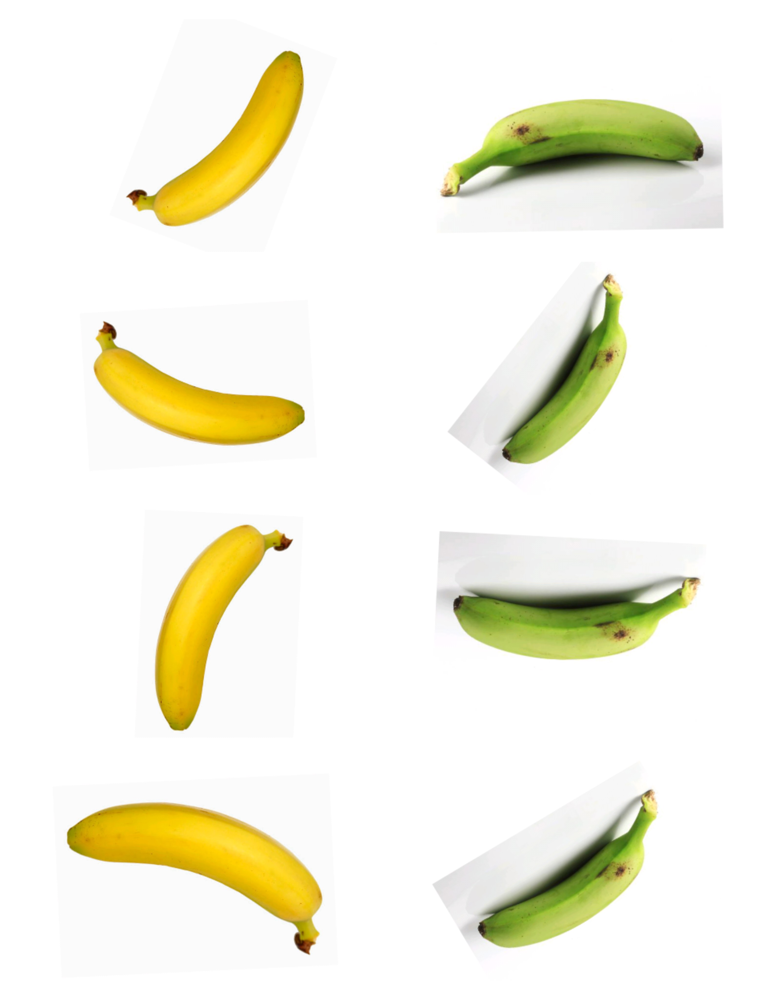
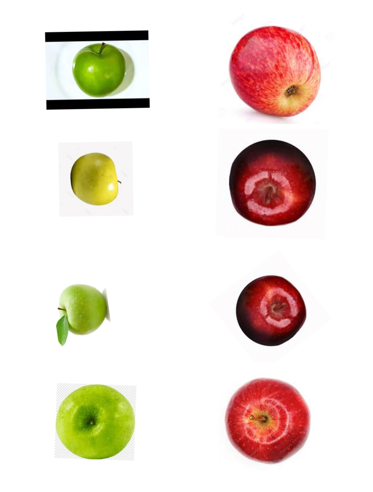
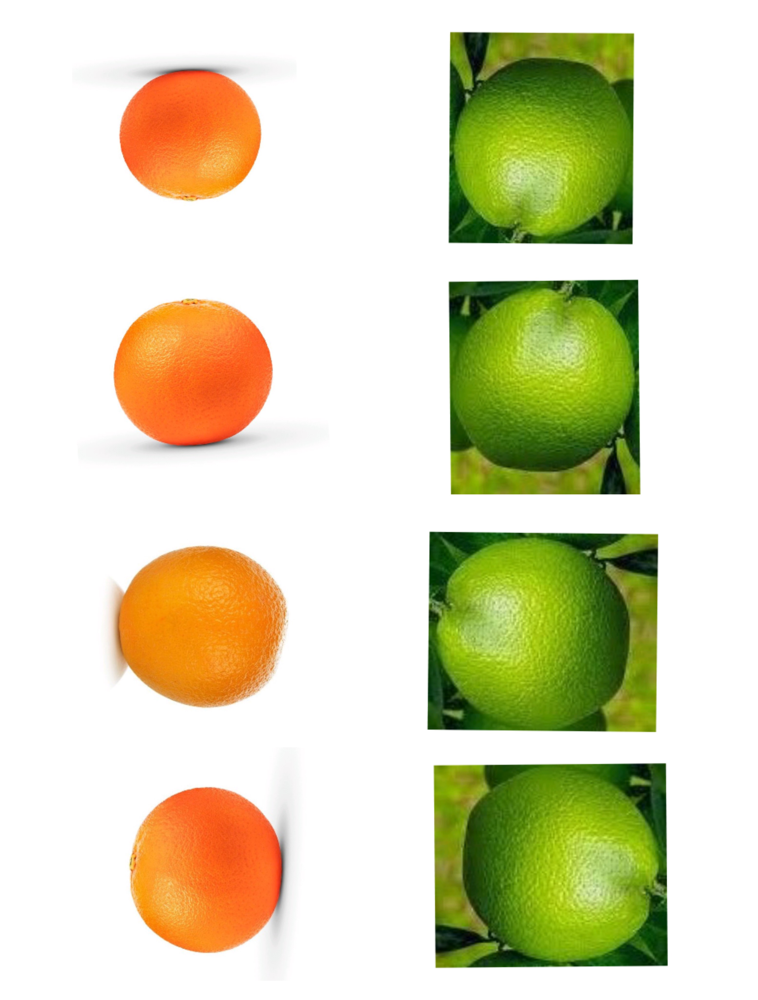
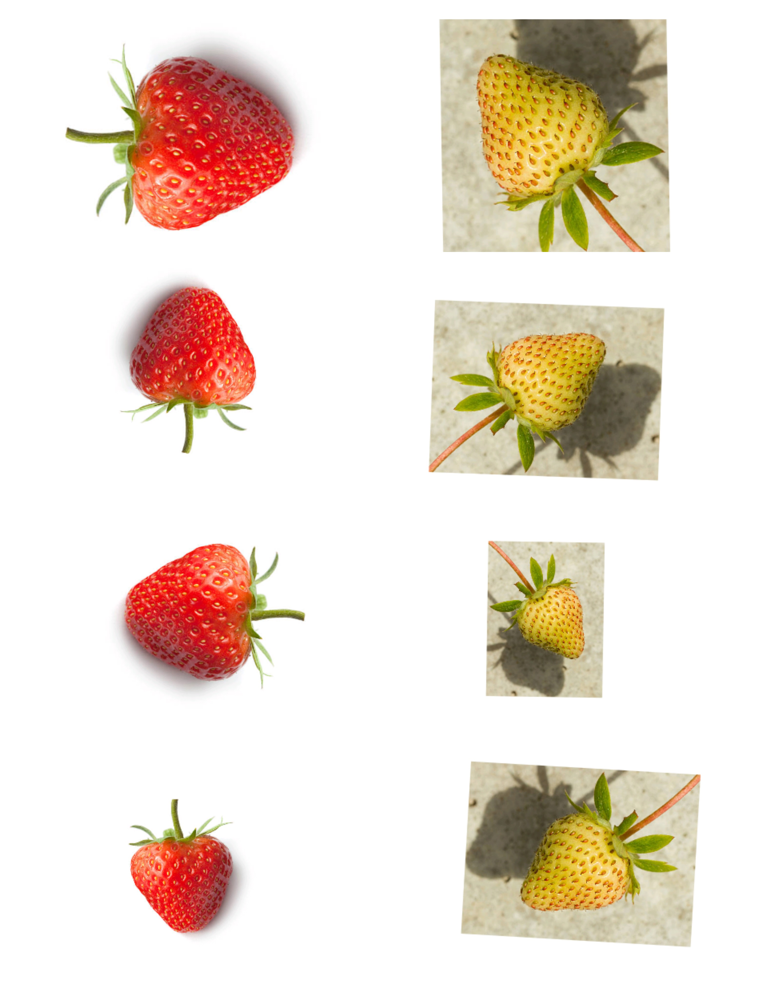
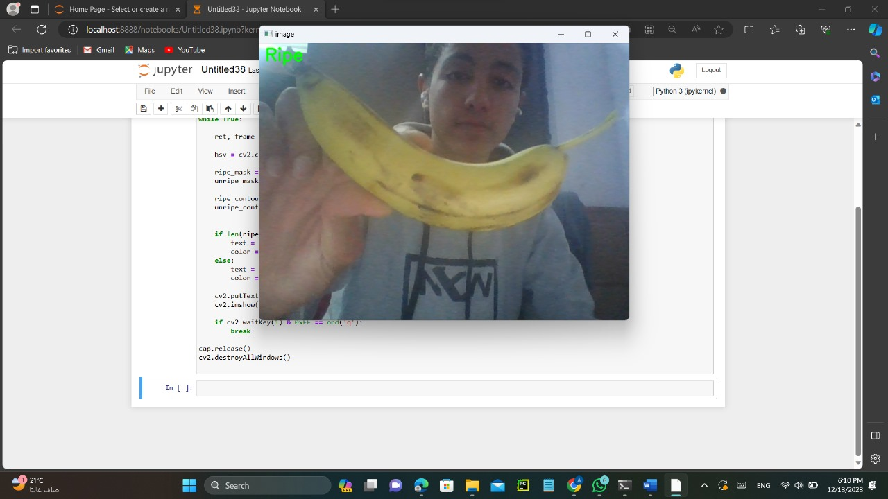

# 🍎 Fruit Detection 
Fruit detection is a project based on artificial intelligence and computer vision techniques to help users identify types of fruits and determine whether they are ripe or unripe. The project also aims to help detect spoiled fruits, which helps users choose safer fruits and reduce food waste.
## Problem 
The problem is that there are rotten and unripe fruits that​ cause many diseases to humans. Eating unhealthy food​ can harm health and reduce the ability to perform normal​ daily activities.​

## Solution 
​Our solution is to make an application through which the fruit is photographed and determine whether it is ripe or not. ​

## Other solutions
Other solutions you may soon be able to tell if a fruit is ripe or not, thanks to a new  device developed by some researchers, including ​

one of Indian origin. The device can evaluate how ripe the fruit is by measuring the growth of chlorophyll in the fruit’s skin under ultraviolet rays.​
## 📸 Project Demo

### Input

  
  
  
  

### Detection Result

  

